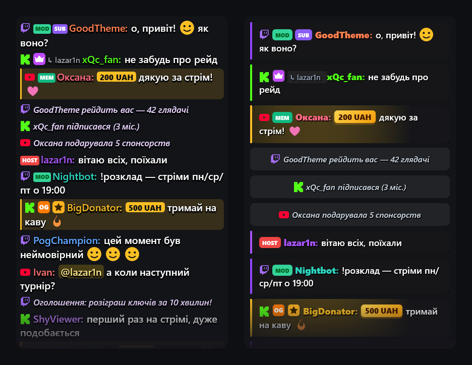
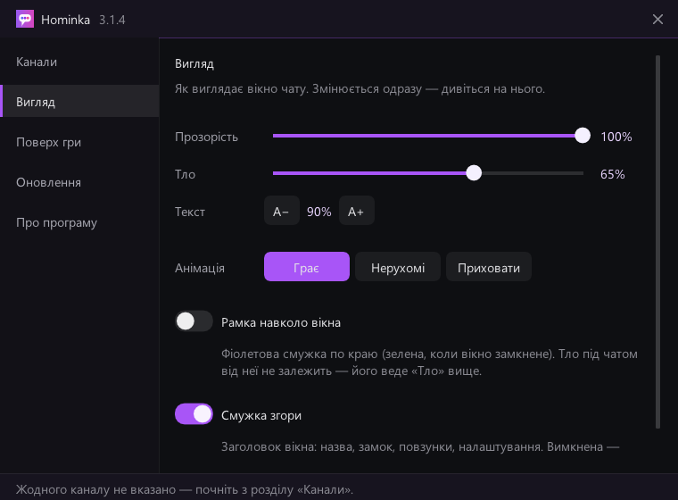
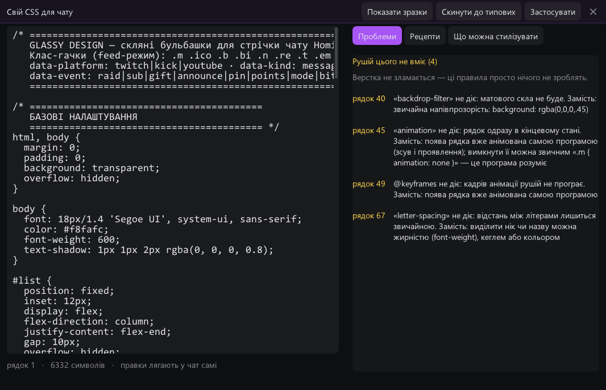

<div align="center">


# Hominka

**Your stream chat on top of the game — visible to you, invisible to OBS.**

Twitch, Kick and YouTube in one feed, styled with your own CSS, drawn by a
6 MB native app that stays out of your stream.

[](https://github.com/kiskaserver/hominka/actions/workflows/build.yml)
[](https://github.com/kiskaserver/hominka/releases/latest)
[](LICENSE)


[**Download**](https://hominka.app) · [Changelog](CHANGELOG.md) · [How it works](docs/architecture.md) · [Build from source](docs/building.md)

English · [Українська](README.uk.md) · [Русский](README.ru.md)



</div>

## Why

On one monitor you cannot read chat while you play — and a chat you put on top
of the game ends up in your stream. Hominka's window is excluded from screen
capture by Windows itself, so OBS Display, Window and Game Capture record the
game without it, even while it sits on top of everything.

## Features

- **Hidden from capture.** `WDA_EXCLUDEFROMCAPTURE` — the OS leaves the window
  out of every capture API. Not a window-ordering trick.
- **One feed.** Twitch, Kick and YouTube at once, with platform icons, badges,
  replies, donations, Super Chats, raids and subs.
- **Emotes that move.** 7TV, BetterTTV and FrankerFaceZ, animated — or frozen
  on the first frame, or hidden, if you prefer.
- **Your own CSS.** A real CSS engine lays out every message. The built-in
  editor checks your theme as you type, lists every rule the engine will
  ignore, ships ready-made recipes and documents every class.
- **Out of the way.** Lock it (Ctrl+Alt+Space) and clicks go straight through to
  the game. It never takes focus.
- **Inside full-screen games.** For games that take the screen exclusively, the
  optional in-game overlay draws the chat inside the game's own frame —
  DirectX 9, 11, 12, OpenGL and Vulkan. It refuses outright to touch games with
  kernel anti-cheat.
- **Light.** One native executable, about 50 MB of RAM, and no GPU work at all
  while chat is quiet. No browser, no runtime.
- **Updates itself, safely.** Stable, beta and dev channels; every release is
  signed with Ed25519 and verified before it is installed.
- **Private.** No account, no telemetry, no server of ours in the middle.

<div align="center">


</div>

## Install

**Windows 10 (2004+) and 11.** Download the archive from
[hominka.app](https://hominka.app) or [Releases](https://github.com/kiskaserver/hominka/releases/latest),
unpack it anywhere and run `Hominka.exe`. There is no installer; settings live in
`%LOCALAPPDATA%\Hominka`.

**Linux (x86_64, X11).** Download the AppImage, make it executable and run it.
X11 and Wayland cannot hide a window from capture, so capture the game window
rather than the whole screen (Window Capture, PipeWire or `obs-vkcapture`).

> SmartScreen or Chrome may warn about the download. Every release is a new,
> unsigned file with no download history yet — see
> [docs/false-positives.md](docs/false-positives.md) for what that means and
> what we do about it.

## Quick start

1. Click the gear on the chat window and enter your channels.
2. Move and resize the window where you want to read chat.
3. Press **Ctrl+Alt+Space** to lock it — the mouse now goes to the game.

## Building

Everything builds in Docker, on any host:

```sh
docker build -t hominka-native native                               # Windows binaries
docker build -t hominka-linux -f linux/Dockerfile . \
  && docker run --rm -v "$PWD:/src" hominka-linux                   # Linux AppImage
```

Details, test hosts and command-line checks are in [docs/building.md](docs/building.md).

## Documentation

| | |
|---|---|
| [docs/architecture.md](docs/architecture.md) | How chat becomes pixels, the capture-excluded window, the in-game overlay |
| [docs/building.md](docs/building.md) | Building both platforms, testing the in-game overlay |
| [docs/releasing.md](docs/releasing.md) | Release channels, signing, publishing |
| [CONTRIBUTING.md](CONTRIBUTING.md) | How to propose a change |
| [SECURITY.md](SECURITY.md) | Reporting a vulnerability, how updates are protected |

## License

[GNU General Public License v3.0](LICENSE). Third-party components and their
licenses are listed in [THIRD_PARTY_NOTICES.md](THIRD_PARTY_NOTICES.md).

The name comes from Ukrainian *гомін* — the hum of many voices.
