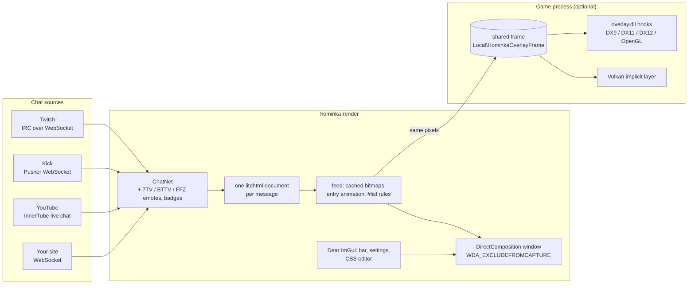

# Architecture

Hominka is one native process. It reads chat from the platforms itself, lays
every message out with a real CSS engine, and shows the result in a window that
the operating system keeps out of screen capture. An optional second path puts
the same pixels inside a full-screen game's own frame.

## Chat

`native/render/src/net/` holds one source per platform. Each turns the
platform's wire format into the same message model (author, colour, badges,
parts of text and emotes, reply, donation, system event), so everything after
this point is platform-agnostic. Third-party emote sets (7TV, BetterTTV,
FrankerFaceZ) and badge images are fetched once per channel and cached.

## Rendering

A message becomes a small HTML document: the base stylesheet, then the user's
own CSS below it, exactly as in a browser. [litehtml](https://github.com/litehtml/litehtml)
lays it out; a `document_container` draws it — Direct2D/DirectWrite on Windows
(`gfx/container_d2d.cpp`), Blend2D/FreeType on Linux (`gfx/container_bl.cpp`).

Each message is rendered **once** into a cached bitmap. The feed then only
stacks bitmaps and animates their entry, so a busy chat costs one layout per new
line, not per frame, and a quiet chat costs nothing: the window presents only
when something changed.

litehtml is not a browser. `@keyframes`, `filter`, `backdrop-filter` and parts
of grid are not supported; the CSS editor lists every rule in a theme that the
engine will ignore, with a suggested replacement.

## The window

A `WS_POPUP` with `WS_EX_NOREDIRECTIONBITMAP`: its content comes only from a
premultiplied-alpha flip swap chain bound through DirectComposition, so there is
no redirection surface to copy and per-pixel transparency is free.

- **Hidden from capture.** `SetWindowDisplayAffinity(WDA_EXCLUDEFROMCAPTURE)`
  (Windows 10 2004+) makes the OS itself leave the window out of every capture
  API — OBS Display, Window and Game Capture record the game without it.
- **Click-through.** `WS_EX_LAYERED | WS_EX_TRANSPARENT` while locked or not
  hovered. `WS_EX_TRANSPARENT` alone is not enough: without `WS_EX_LAYERED`,
  Windows still delivers the click to the window.
- **No focus.** `WS_EX_NOACTIVATE`: the game never loses focus to the chat.

The bar, the settings window and the CSS editor are Dear ImGui with FreeType
rasterisation (hinting matters at 18 px — `stb_truetype` ignores it).

## In-game overlay

For games in exclusive full-screen, where the compositor is bypassed and no
window can be shown on top, Hominka can draw inside the game's frame:

1. The app writes each rendered frame into shared memory. The layout is a fixed
   header plus premultiplied BGRA pixels, synchronised with a **seqlock**: the
   writer makes the sequence odd while writing, the reader skips a frame whose
   sequence is odd or changed. The game never waits on Hominka, and if Hominka
   exits the overlay simply keeps its last frame.
2. `injector.exe` loads `overlay.dll` into the chosen game, which hooks
   `Present` / `ExecuteCommandLists` / `wglSwapBuffers` and composites the frame.
   Vulkan games get the same through an implicit layer, registered only while
   the in-game overlay is in use.
3. Position and size are stored as a fraction of the monitor, so the chat sits
   where the desktop window sits, at any game resolution.

`native/common/guard.h` refuses outright to inject into games with kernel-level
anti-cheat (Valorant, CS2, Apex Legends, Fortnite, PUBG, Rust, Escape from
Tarkov and others) and into any process where an anti-cheat module is loaded.
It is not a warning with a checkbox: a DLL in a competitive game's process is
what gets accounts banned.

## Updates

Three channels — stable, beta, dev — are three signed JSON manifests. The app
verifies the manifest's Ed25519 signature and the archive's SHA-256 before
installing. On Windows a small helper replaces the program folder after the app
exits and starts it again; on Linux the AppImage is replaced with an atomic
`rename()` and the process re-executes itself. See [releasing.md](releasing.md).

## Linux

The same core with different edges: an ARGB X11 window, click-through through an
empty XShape input region, the global hotkey through `XGrabKey`, and SDL2 +
OpenGL for the settings windows. X11 and Wayland cannot hide a window from
capture, so on Linux capture the game window rather than the screen.
